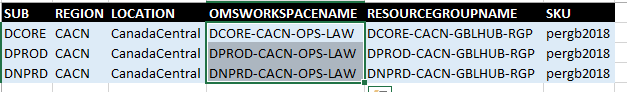
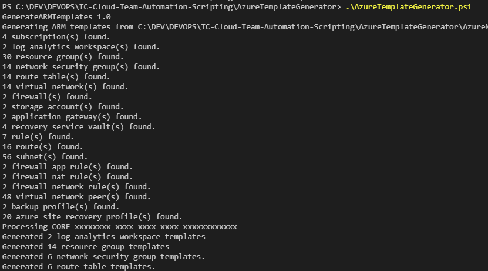

([Français](#gc-fr))

# TC Azure Template Generator

**A kickstart for your PBMM Cloud!**

**_NOTICE_**: _This is a work in progress and no warranty or guarantee is provided or implied. You will need to complete additional tasks (configure monitoring, Active Directory, MFA, etc...) in order to completely satisfy PBMM requirements and security controls for your SA&A._

**_NOTICE 2_**: An issue with IP allocation has been discovered and a fix is coming!

_More complete documentation is "COMING SOON"!_

## What does this thing do?
This solution gives users the ability to manage most network infrastructure settings and configurations from excel. This project comes pre-prepared with an entire sample network infrastructure, including Disaster Recovery region with **Core, Prod and Non Prod Subscriptions**, which can be used or modified to suit your needs.

Running the **AzureTemplateGenerator.ps1** script it will parse the excel file and generate all of the following for a brand new **Enterprise level PBMM Network Infrastructure** in Azure.

Currently generates:

* **Policies** (recommended policies inc. GoC PBMM)
* **Log Analytics Workspaces** (where all logs are accumulated for monitoring, fully applied to all networking resources for full logging OoB and ready to receive workload logs)
* **Resource Groups** (with PBMM policies assigned)
* **Network Security Groups** (fully configured with sample rules)
* **Route Tables** (with typical routing assigned)
* **Virtual Networks** (including peering)
* **Application Gateway** (with very basic configuration)
* **Azure Firewall** (preconfigured with several sample rules)
* **Storage Accounts** (for operations usage)
* **Recovery Service Vaults** (configured for both Azure Site Recovery and Backups)

Coming Soon:
* **Bastion Hosts**
* **Key Vaults**
* **DDOS**
* **VM Templates with hardened DSC configurations**
* **CICD DevOps Pipeline Examples**

Todo List:
* Code refactor
* Move to parameter files rather than hardcoded template files. (more flexibility for CICD)


## What do I do with this?

First off you will need to either create the azure subscriptions you see in the **"SUB"** worksheet and enter the corresponding IDs into the fields provided **OR** you will need to modify the entire excel workbook to suit the subscriptions/infrastructure you wish to use. 


You will also need to specify your own custom and unique names for Log Analytics Workspaces (LAW tab) and Storage Accounts (SA tab)

 

Once you execute the generator you will find a new folder called **"ARM"** in your directory with several folders and files inside.


At the root of this folder you will find a new script called **"RUN-FullDeploy-INF.ps1"**. 


If you choose to execute this script it will execute, in order, all scripts and deploy all resources. This WILL take some time as certain resources, such as application gateways, take a fair number of minutes to provision.

Alternatively, upload all the generated templates and PS scripts to a DevOps repo and set up your own CICD build and release pipelines to manage your ongoing operations.

## What do all the worksheet names mean?
```
SUB      - Your subscriptions
LAW      - Log Analytics Workspaces
RG       - Resource Groups
NSG      - Network Security groups
NSGRULES - The Rules used by individual NSGs
RT       - Route Tables
ROUTES   - Traffic Routes used by Route Tables
VNET     - Virtual Networks
SUBNET   - Subnets used within Virtual Networks
PEER     - VNET Peerings
AG       - Application Gateway
FW       - Azure Firewalls
FWAPP    - Application Rules for Firewall(s)
FWNAT    - NAT Rules for Firewall(s)
FWNET    - Network Rules for Firewall(s)
SA       - Storage Accounts
RSV      - Recovery Service Vaults
BCK      - Backup Policies for RSV
ASR      - Azure Site Recovery Settings
IP       - Unused by script but useful for managing your IP allocations (implement in SUBNET worksheet)
```
## How is network traffic regulated in the sample infrastructure?
This is complicated! But it isn't all that bad. We'll keep this explanation simple:

First Here's the naming convention for our resources: SUBSCRIPTION-REGION-RESOURCENAME-RESOURCETYPE

Ex. CORE-CACN-EXTHUB-VNET or PROD-CAEA-EXTWORKLOAD-RGP

The following illustrates the sample live environment in Canada Central region and not disaster recovery in Canada East region.

```
- All INBOUND EXTERNAL traffic (IE Internet) is routed to our CORE-CACN-EXTHUB-VNET. 
- INBOUND EXTERNAL Traffic is managed by the Application Gateway and the Azure Firewall and ultimately routed to either PROD-CACN-EXTWORKLOAD-VNET or NPRD-CACN-EXTWORKLOAD-VNET.
- Only OUTBOUND EXTERNAL traffic to the  is permitted from PROD-CACN-INTHUB-VNET and NPRD-CACN-INTHUB-VNET.
- All INBOUND traffic destined for an *-CACN-INTWORKLOAD-VNET is IP restricted to GC IP(s). Please verify this IP list yourself before deploying.
- *NOTE: When SCED is provisioned for your department, you will likely need to make routing changes as all traffic is expected to go through the GC Cap provided by SSC.
- Within each VNET there are of course subnets, route tables and network security groups which regulate pathing and security.
- Our sample provides individual subnets in all four WORKLOAD VNETs for WEB, APP, DATA and MGMT.
- An additional VNET peering is provided between Canada Central and Canada East on the CORE-CACN-INTHUB-VNET and CORE-CAEA-INTHUB-VNET in order to facilitate monitoring, maintenance and disaster recovery.
- ALL network security is configured on a DENY ALL basis. Exceptions can of course be entered on an as-needed basis.
- CORE-CACN-GBLHUB-RGP is where Operations resources live. Ex. Log Analytics Workspace, Bastion Hosts, etc...
```
## What is the license?

Unless otherwise noted, the source code of this project is covered under Crown Copyright, Government of Canada, and is distributed under the [MIT License](LICENSE).

The Canada wordmark and related graphics associated with this distribution are protected under trademark law and copyright law. No permission is granted to use them outside the parameters of the Government of Canada's corporate identity program. For more information, see [Federal identity requirements](https://www.canada.ca/en/treasury-board-secretariat/topics/government-communications/federal-identity-requirements.html).

______________________
<a name="gc-fr"></a> (Machine Translated, official translation coming soon!)
# TC Azure Template Generator

** Un kickstart pour votre cloud PBMM! **

** _ AVIS _ **: _Ceci est un travail en cours et aucune garantie n'est fournie, ni implicite. Vous devrez effectuer des tâches supplémentaires (configuration de la surveillance, Active Directory, MFA, etc.) afin de satisfaire pleinement aux exigences PBMM et aux contrôles de sécurité de votre SA & A._

_La documentation la plus complète est "À VENIR"! _

## Que fait cette chose?
Cette solution permet aux utilisateurs de gérer la plupart des paramètres d’infrastructure réseau et des configurations d’Excel. Ce projet est livré pré-préparé avec un exemple d'infrastructure réseau complet, y compris une région de récupération après sinistre avec ** abonnements Core, Prod et non Prod **, qui peuvent être utilisés ou modifiés pour répondre à vos besoins.

Si vous exécutez le script ** AzureTemplateGenerator.ps1 **, il analysera le fichier excel et générera tous les éléments suivants pour une toute nouvelle ** infrastructure réseau PBMM de niveau entreprise ** dans Azure.

Génère actuellement:

* ** Politiques ** (politiques recommandées inc. PBM du GC)
* ** Espaces de travail Log Analytics ** (où tous les journaux sont accumulés pour la surveillance, appliqués intégralement à toutes les ressources réseau pour une journalisation complète OoB et prêts à recevoir des journaux de charge de travail)
* ** Groupes de ressources ** (avec des stratégies PBMM attribuées)
* ** Groupes de sécurité réseau ** (entièrement configurés avec des exemples de règles)
* ** Tables de routage ** (avec routage typique attribué)
* ** Réseaux virtuels ** (y compris peering)
* ** Application Gateway ** (avec une configuration très basique)
* ** Pare-feu Azure ** (préconfiguré avec plusieurs exemples de règles)
* ** Comptes de stockage ** (pour l'utilisation des opérations)
* ** Emplacements de stockage du service de récupération ** (configurés pour Azure Site Recovery et les sauvegardes)

Bientôt disponible:
* ** Hôtes Bastion **
* ** Coffres à clés **
* ** DDOS **
* ** Modèles de machines virtuelles avec configurations DSC renforcées **
* ** Exemples de pipeline DevOps CICD **

Liste de choses à faire:
* Code refactor
* Déplacer vers des fichiers de paramètres plutôt que des fichiers de modèle codés en dur. (plus de flexibilité pour CICD)


![Présentation du schéma de réseau] (./resources/readme_diagram_overview.png)

## Qu'est-ce que je fais avec ça?

Tout d'abord, vous devrez soit créer les abonnements azure que vous voyez dans la feuille de calcul ** "SUB" ** et entrer les identifiants correspondants dans les champs fournis ** OU **, vous devrez modifier l'intégralité du classeur Excel en fonction des abonnements. / infrastructure que vous souhaitez utiliser.


Vous devrez également spécifier vos propres noms uniques et personnalisés pour les espaces de travail Log Analytics (onglet LAW) et les comptes de stockage (onglet SA).

 

Une fois que vous avez exécuté le générateur, vous trouverez un nouveau dossier appelé ** "ARM" ** dans votre répertoire avec plusieurs dossiers et fichiers.


À la racine de ce dossier, vous trouverez un nouveau script appelé ** "RUN-FullDeploy-INF.ps1" **.


Si vous choisissez d'exécuter ce script, il exécutera, dans l'ordre, tous les scripts et déploiera toutes les ressources. Cela prendra un certain temps, car certaines ressources, telles que les passerelles d’application, prennent un bon nombre de minutes à mettre en service.

Vous pouvez également télécharger tous les modèles et scripts PS générés sur un référentiel DevOps et configurer vos propres pipelines de génération et de version de CICD pour gérer vos opérations en cours.

## Que signifient tous les noms de feuilles de calcul?
`` `
SUB - Vos abonnements
LAW - Espaces de travail Log Analytics
RG - Groupes de ressources
NSG - Groupes de sécurité réseau
NSGRULES - Les règles utilisées par les NSG individuels
RT - Tableaux de route
ROUTES - Routes de trafic utilisées par les tables de route
VNET - Réseaux virtuels
SUBNET - Sous-réseaux utilisés dans les réseaux virtuels
PEER - Peerings VNET
AG - Passerelle d'applications
FW - Azure Firewalls
FWAPP - Règles d'application pour les pare-feu
FWNAT - Règles NAT pour les pare-feu
FWNET - Règles de réseau pour les pare-feu
SA - Comptes de stockage
RSV - Coffres-forts du service de récupération
BCK - Politiques de sauvegarde pour RSV
ASR - Paramètres de récupération du site Azure
IP - Inutilisé par script mais utile pour gérer vos allocations IP (implémenter dans la feuille de calcul SUBNET)
`` `
## Comment le trafic réseau est-il régulé dans l'exemple d'infrastructure?
C'est compliqué! Mais ce n'est pas si grave. Nous allons garder cette explication simple:

Tout d'abord, voici la convention de dénomination de nos ressources: SUBSCRIPTION-REGION-RESOURCENAME-RESOURCETYPE

Ex. CORE-CACN-EXTHUB-VNET ou PROD-CAEA-EXTWORKLOAD-RGP

Ce qui suit illustre l’échantillon d’environnement vivant dans la région du centre du Canada et non une reprise après sinistre dans la région du Canada Est.

`` `
- Tout le trafic INBOUND EXTERNAL (Internet IE) est acheminé vers notre serveur CORE-CACN-EXTHUB-VNET.
- Le trafic INBOUND EXTERNAL est géré par la passerelle d'applications et le pare-feu Azure, puis acheminé vers PROD-CACN-EXTWORKLOAD-VNET ou NPRD-CACN-EXTWORKLOAD-VNET.
- Seul le trafic OUTBOUND EXTERNAL vers le est autorisé à partir de PROD-CACN-INTHUB-VNET et de NPRD-CACN-INTHUB-VNET.
- Tout le trafic INBOUND destiné à un * -CACN-INTWORKLOAD-VNET est limité à un ou plusieurs IP du GC. S'il vous plaît vérifier cette liste IP vous-même avant de déployer.
- * REMARQUE: lorsque SCED est configuré pour votre service, vous devrez probablement apporter des modifications d'acheminement, car tout le trafic est censé transiter par le cap du GC fourni par SPC.
- Au sein de chaque réseau virtuel, il y a bien sûr des sous-réseaux, des tables de routage et des groupes de sécurité réseau qui régulent le cheminement et la sécurité.
- Notre exemple fournit des sous-réseaux individuels dans les quatre réseaux virtuels WORKLOAD pour WEB, APP, DATA et MGMT.
- Une liaison de réseau VNET supplémentaire est fournie entre le centre du Canada et le centre du Canada-Est sur les réseaux CORE-CACN-INTHUB-VNET et CORE-CAEA-INTHUB-VNET afin de faciliter la surveillance, la maintenance et la reprise après sinistre.
- TOUTE la sécurité du réseau est configurée sur une base DENY ALL. Des exceptions peuvent bien entendu être saisies au besoin.
- CORE-CACN-GBLHUB-RGP est l'endroit où vivent les ressources opérationnelles. Ex. Log Analytics Workspace, hôtes Bastion, etc.
`` `
## Quelle est la licence?

Sauf indication contraire, le code source de ce projet est couvert par le droit d'auteur de la Couronne, gouvernement du Canada, et est distribué sous la [Licence MIT] (LICENCE).

Le mot-symbole Canada et les graphiques associés associés à cette distribution sont protégés par le droit des marques et le droit d'auteur. Aucune autorisation n'est accordée pour les utiliser en dehors des paramètres du programme d'identité visuelle du gouvernement du Canada. Pour plus d'informations, voir [Exigences en matière d'identité fédérale] (https://www.canada.ca/fr/secretariat-conseil-tresor/sujets/communications-gouvernementales/exigences-image-marque.html).
